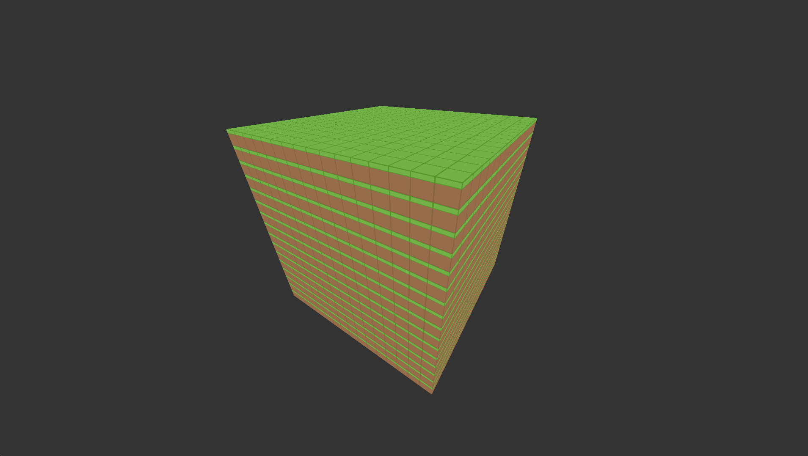

# Raycaster
This project is a world generator / voxel renderer made using C++17, OpenGL and GLFW, also using stb_image for textures.
I am interested in understanding how games like minecraft generate the worlds and how that works
in terms of graphics so this project is a way to understand the process better

# Example
Here is an example where I am currently at, with a first person camera, textured cubes, and the first chunk generated
